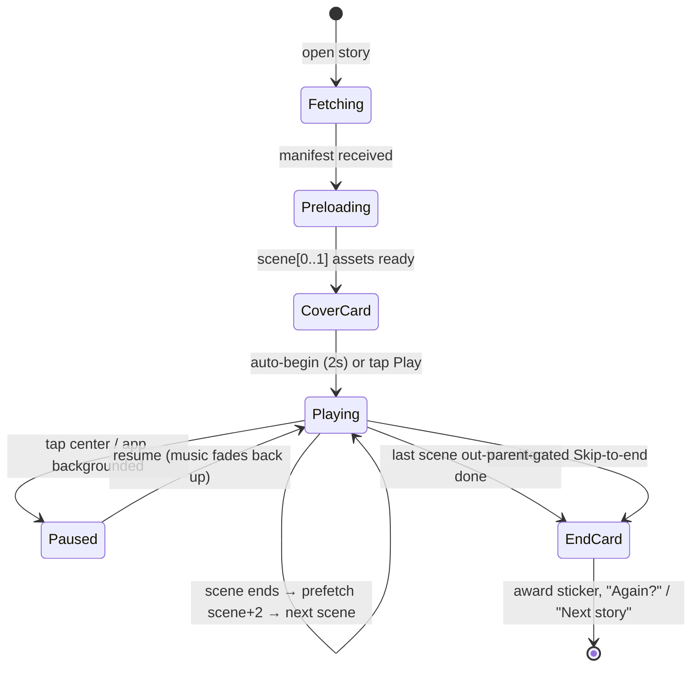

# BrightMind Kids — Cinematic Storytelling Redesign

> A ground-up redesign of the story experience: from "image + narration + tap task"
> to a **director-driven animated film** the child simply watches.
>
> Status: design spec (Phase 1.5 / Phase 2). Grounds the next implementation of
> `features/learn/` and the backend `cinematic.schema.ts`.

---

## 0. The one-sentence thesis

**Today a scene is a *slide* (a picture you must poke). It should be a *timeline* (a
director's track that plays itself).** Every architectural decision below follows
from that single change: the atomic unit of a story is not a *scene with an
interaction*, it is a **scene as an ordered list of timed cues** — camera moves,
character actions, lines of dialogue, music swells, ambient triggers — that advance
on a clock, with optional, non-blocking reactions layered on top.

---

## 1. UX Review — what's wrong today, and the principles that fix it

### What the current build gets right (keep these)
- **Offline-first vector baseline.** Closed enums (`SceneBackground`, `PropKind`,
  `CharacterKind`, `ParticleKind`) mean a story plays with zero downloaded assets.
  This is a genuine competitive moat vs. Netflix/Disney (they can't play on a plane
  with no signal). **We keep the vector stage as the guaranteed floor** and layer
  richer renderers above it.
- **Lenient parsing.** Unknown wire values degrade to a safe default. Non-negotiable
  for a platform that will ship new vocabulary faster than app updates. **Preserved.**
- **`minDuration` already exists** — the seed of a timeline. We grow it into one.

### What's broken (the "mini-game" feeling)
1. **Interaction is structural, not optional.** `StoryScene.interaction` sits at the
   same level as `narration`. A single interaction per scene *is* the scene's spine,
   so the child learns "watch a bit → do a chore → repeat." That is a worksheet, not
   a film.
2. **A scene is one frozen beat.** One background, one narration string, one camera
   enum. Real cinema has *beats within a shot*: the camera drifts, the rabbit enters,
   he speaks, he laughs, music swells, we cut. None of that is expressible.
3. **Camera is a single enum** (`zoom_in`, `pan_left`). No target, no speed, no
   sequencing, no easing. You cannot "slowly push in on the tortoise's face."
4. **Audio is one `MusicTrack` for the whole story.** No ambience bed, no ducking
   under narration, no per-beat SFX, no music that *changes with emotion* — which the
   brief explicitly asks for.
5. **Narration is one blob.** No word timing, so no read-along highlighting, no
   karaoke, no accessibility captions synced to voice.
6. **No emotional metadata.** Nothing tells the engine (or a future AI author) the
   *mood* of a beat, so pacing, music, and lighting can't respond to it.

### The governing principles (research-backed)
- **Autoplay is the default; tapping is garnish.** Preschool attention runs
  ~8–10 min for ages 4–6; a story must *carry itself* and never stall waiting for a
  finger. Optional touches add delight but never gate progress. (Nielsen/Ramotion &
  daycare-UX guidance on short, self-driving, immediately-reactive interactions.)
- **Every touch still reacts instantly** — a tap makes the butterfly sparkle *now* —
  because "tap and nothing happens = broken/boring" to a child. Reactive ≠ required.
- **Slow edutainment / architecture of calm.** Pok Pok and the Montessori/Reggio
  "calm, unhurried" digital philosophy: reduce stimulation, respect the child's
  cognitive rhythm, let scenes *breathe* with dramatic pauses (the Pixar *Up* montage
  tells whole emotional arcs with no dialogue and lots of silence).
- **Multimodal comprehension.** Synced audio + visual + word highlighting deepens
  retention (EPUB Media Overlays / read-along research). Build word timing in from
  day one even if we light it up later.
- **Show, don't instruct.** Narration *describes* ("The rabbit laughed so hard he
  rolled over") and the rabbit laughs automatically. Replace every imperative
  ("Tap the rabbit") with narrative causality.

---

## 2. Storytelling Review — think like a storyboard artist

A scene must answer the animation-director's checklist, and our schema must have a
field for each answer:

| Director's question | Schema home |
|---|---|
| Where is the camera? | `camera` keyframes (`from`/`to`: target, zoom, offset) |
| What is moving? | `cues[]` of type `character`/`prop`/`environment` |
| Who is speaking? | `cues[]` of type `dialogue` (speaker + emotion) + `narration` |
| What emotion is shown? | `mood` on the scene, `emotion` on each character cue |
| What music is playing? | `audio.music` bed + per-beat `music` cues (adaptive) |
| What ambient sound exists? | `audio.ambience` bed + `sfx` cues |
| How does the scene begin/end? | `transition.in` / `transition.out` |
| Where is the silence? | gaps between cues; explicit `hold` cues (dramatic pause) |

**Pacing is a first-class citizen.** Pixar/Disney encode timing in *panel spacing* —
a dramatic pause = 3 silent close-ups; a chase = 2 dynamic wides. We encode it as
**cue timestamps and `hold` beats**: the schema lets an author place a 1.5s silent
push-in before the tortoise crosses the line. Emotion beats land because we *time*
them, not because we cram them.

---

## 3. Educational Review

- **Learning objective per scene** (`learningObjective`) and per story (`moral`,
  `concepts[]`). Every beat can *carry* teaching without becoming a quiz.
- **No fail states** (house rule §5). Optional interactions only ever add sparkle;
  there is no "wrong." A future quiz lives *between* scenes as a separate,
  skippable "Wondering moment," never mid-narrative.
- **Vocabulary scaffolding.** Word-level narration timing enables read-along
  highlighting (Montessori "sound it out" pace = single-word granularity at slow VO;
  the research warns to drop to sentence granularity at normal speed to avoid the
  "catch-me-if-you-can" flicker — we store both grains).
- **Emotional literacy.** Characters carry an `emotion` enum (proud, worried, kind,
  sleepy…). Naming feelings on-screen + in narration is core early-childhood SEL.
- **Age banding drives pacing, not content gating.** `ageBand` selects default scene
  durations, VO speed, and word-highlight granularity — juniors get slower, longer
  holds; older kids get tighter cuts.

---

## 4. Architecture Review — the core shift

```
BEFORE  (slide model)                AFTER  (director model)
─────────────────────                ─────────────────────────────
Story                                Story
 └ Scene                              └ Scene  (a SHOT with a duration)
    ├ background (enum)                  ├ stage      (layered renderers)
    ├ narration  (string)                ├ camera     (keyframed rig)
    ├ camera     (enum)                  ├ audio      (music + ambience beds)
    ├ props[]                            ├ mood / lighting / weather / timeOfDay
    ├ characters[]                       ├ transition (in / out)
    └ interaction (BLOCKING) ◄── kill    ├ cast[]     (characters w/ emotion)
                                         ├ cues[]     (TIMED beats — the timeline)
                                         │   dialogue | camera | character |
                                         │   sfx | music | ambient | hold |
                                         │   caption | interaction(optional)
                                         └ narration  { text, marks[] }  (word timing)
```

Three invariants we defend:
1. **Offline vector baseline never regresses.** Enums stay; new renderers are
   *additive* (`renderer: "vector" | "image" | "rive" | "lottie" | "spine" | "sprite"`).
2. **The timeline is authoritative; assets are decoration.** A story with only
   `narration` + `cues` of `hold`/`camera` still plays as a Ken-Burns vector film.
3. **Forward-compat by discriminated unions + lenient parse.** New cue types,
   renderers, transitions all degrade to `hold`/`vector`/`fade` on old clients.

---

## 5. Scene Flow Diagram

### 5a. Story-level lifecycle



### 5b. Within a single scene (the timeline)

```
t=0.0s  transition.in (fade 0.6s) ─ music bed crossfades in ─ ambience starts
0.6s    camera keyframe A → B begins (slow push-in, 6s, easeInOutSine)
0.8s    narration VO starts ─ word-marks drive optional highlight
1.2s    cue: character "hare" enter from left, anim=hop
3.0s    cue: dialogue hare "I'll win easily!"  emotion=proud   (music ducks -6dB)
5.0s    cue: hold 1.2s  (silent beat — the boast lands)
6.2s    cue: sfx "whoosh" + character hare anim=run
8.0s    [optional hotspots live the whole time: tap butterfly → sparkle]
8.5s    scene minDuration met AND narration done AND camera settled
8.5s    transition.out (dissolve 0.7s) → director advances to next scene
```

**Advance rule:** a scene ends when `max(minDuration, lastCueEnd, narrationEnd)` is
reached *and* the camera has settled — then the out-transition plays. Optional
interactions never appear in this condition.

---

## 6. New JSON Schema (v2 — "director track")

Wire format is JSON; every visual/audio token is a **closed enum with lenient
parse** so stories stay offline-playable and forward-compatible. Illustration /
Rive / audio asset URLs are always *optional enrichment* over the enum baseline.

```jsonc
{
  "schemaVersion": "2.0",
  "id": "story_hare_tortoise",
  "slug": "hare-and-tortoise",
  "title": "The Hare and the Tortoise",
  "lang": "en",                         // BCP-47; text fields are in this language
  "availableLangs": ["en", "hi"],       // for the language picker / prefetch
  "ageBand": "junior",                  // junior(2-4) | explorer(5-6) — drives pacing
  "category": "Moral Stories",
  "concepts": ["persistence", "humility", "kindness"],
  "moral": "Slow and steady wins the race.",
  "estimatedDuration": 210,             // seconds, for the library card

  "cover": {
    "emoji": "🐢",                       // offline baseline
    "image": "https://cdn/…/cover.webp", // optional
    "palette": ["#2EBDB5", "#FFCC40"]    // for card gradient + splash tint
  },

  "audio": {                            // STORY-level default beds (scenes override)
    "music":    { "track": "playful", "volume": 0.6, "loop": true },
    "ambience": { "bed": "meadow",    "volume": 0.4, "loop": true },
    "voicePack": "warm_female_en",      // narrator identity; multiple narrators OK
    "narrationSpeed": 1.0
  },

  "reward": { "stars": 10, "coins": 5, "badgeStickerId": "trophy" },

  "assetManifest": [                    // everything the preloader needs, versioned
    { "id": "img_meadow",  "type": "image", "url": "…/meadow.webp",  "bytes": 88000, "v": 3 },
    { "id": "rive_hare",   "type": "rive",  "url": "…/hare.riv",     "bytes": 42000, "v": 2 },
    { "id": "mus_playful", "type": "audio", "url": "…/playful.ogg",  "bytes": 310000,"v": 1 }
  ],

  "scenes": [
    {
      "id": 1,
      "title": "The Boast",
      "minDuration": 9.0,               // floor; timeline may run longer

      // ── ENVIRONMENT ─────────────────────────────────────────────
      "background": "village",          // enum baseline (offline)
      "mood": "cheerful",               // cheerful|calm|tense|triumphant|tender|sleepy
      "timeOfDay": "morning",           // dawn|morning|noon|afternoon|dusk|night
      "weather": "clear",               // clear|cloudy|rain|snow|windy|fog
      "lighting": "warm",               // warm|cool|golden|moonlit|overcast
      "learningObjective": "Pride comes before the fall.",

      // ── STAGE (layered renderers; first that loads wins per layer) ─
      "stage": {
        "renderer": "auto",             // auto = image→rive→vector fallback chain
        "image": "img_meadow",          // optional full-bleed illustration
        "layers": [                     // parallax depth for the vector/image stage
          { "z": 0, "props": [ { "id": "hills", "kind": "mountain", "x": 0.5, "y": 0.7, "scale": 2 } ] },
          { "z": 1, "props": [ { "id": "tree1", "kind": "tree", "x": 0.15, "y": 0.6 } ] }
        ]
      },

      // ── CAST (who is on stage; emotion is first-class) ────────────
      "cast": [
        { "id": "hare",     "kind": "rabbit", "asset": "rive_hare",
          "x": 0.35, "y": 0.62, "scale": 1.0, "facing": "right",
          "emotion": "proud",  "entrance": { "from": "left",  "at": 1.2 } },
        { "id": "tortoise", "kind": "turtle",
          "x": 0.62, "y": 0.66, "scale": 0.9, "facing": "left",
          "emotion": "calm" }
      ],

      // ── CAMERA (keyframed rig, not an enum) ───────────────────────
      "camera": {
        "from": { "target": "hare", "zoom": 1.0, "offset": [0, 0] },
        "to":   { "target": "hare", "zoom": 1.25, "offset": [0.05, -0.03] },
        "duration": 6.0, "ease": "easeInOutSine", "startAt": 0.6
      },

      // ── AUDIO overrides for this scene ────────────────────────────
      "audio": {
        "music":    { "track": "playful", "volume": 0.6 },
        "ambience": { "bed": "birds_meadow", "volume": 0.45 }
      },

      // ── TRANSITIONS ───────────────────────────────────────────────
      "transition": { "in": { "type": "fade", "duration": 0.6 },
                      "out": { "type": "dissolve", "duration": 0.7 } },

      // ── NARRATION (with optional word timing → read-along) ─────────
      "narration": {
        "text": "In a sunny village, a speedy hare loved to brag about how fast he was.",
        "marks": [                      // SMIL-style word timing (optional; TTS can fill)
          { "w": "In",      "t": 0.80 }, { "w": "a", "t": 0.98 },
          { "w": "sunny",   "t": 1.10 }, { "w": "village", "t": 1.55 }
          /* … one entry per word; granularity="word" for juniors, "sentence" fallback */
        ],
        "granularity": "word"
      },

      // ── CUES (THE TIMELINE — ordered, timestamped beats) ──────────
      "cues": [
        { "t": 1.2, "type": "character", "target": "hare", "action": "hop" },
        { "t": 3.0, "type": "dialogue",  "speaker": "hare",
          "text": "I'm the fastest! Nobody can beat me!",
          "emotion": "proud", "duckMusicDb": -6 },
        { "t": 5.2, "type": "character", "target": "hare", "action": "laugh" },
        { "t": 5.4, "type": "hold", "duration": 1.2 },          // dramatic pause
        { "t": 6.8, "type": "sfx", "sound": "giggle", "volume": 0.7 },

        // ── OPTIONAL, NON-BLOCKING reaction (never gates advance) ──
        { "t": 0.0, "type": "interaction", "optional": true,
          "trigger": "tap", "target": "butterfly",
          "reaction": "sparkle", "sound": "twinkle",
          "narrateOnMiss": false }     // if ignored, story flows on untouched
      ]
    }

    /* … more scenes … */
  ]
}
```

### Enum vocabularies (extend the existing closed enums; all lenient-parsed)
- **`transition.type`**: `cut | fade | dissolve | slide | irisIn | irisOut | whipPan | pageTurn` → fallback `fade`.
- **`camera.ease`**: `linear | easeIn | easeOut | easeInOut | easeInOutSine | easeOutBack` → fallback `easeInOut`.
- **`cue.type`**: `dialogue | character | prop | camera | sfx | music | ambient | hold | caption | interaction` → unknown cue *skipped*.
- **`character.action`**: extend `CharacterAnimation` with `laugh | cry | jump | run | sleep | nod | shake | fall | celebrate` → fallback `idle`.
- **`emotion`**: `neutral | happy | proud | worried | sad | scared | kind | sleepy | surprised | determined` → fallback `neutral`.
- **`mood`**: `cheerful | calm | tense | triumphant | tender | sleepy | mysterious` → fallback `calm`.
- **`stage.renderer`**: `auto | vector | image | rive | lottie | spine | sprite` → fallback `vector`.

### Why this schema scales to the "future" list in the brief
| Future feature | Already has a home |
|---|---|
| Voice packs / multiple narrators | `audio.voicePack`; `dialogue.speaker` |
| AI-generated stories | LLM emits *script + enum cues only*; assets optional |
| Multiple languages | `lang`, `availableLangs`, per-lang bundle URLs |
| Cinematic transitions | `transition.in/out` union |
| Adaptive music | per-beat `music` cues keyed off `mood` |
| Rive / Lottie / Spine / sprites | `stage.renderer` + `assetManifest` |
| Particle systems | existing `ParticleKind`, promoted to a `cue` type |
| Quizzes / AR / bedtime / karaoke | additive scene-level blocks (`quiz`, `arAnchor`, `bedtimeMode`); word `marks[]` already there |
| Word highlighting / subtitles / lip-sync | `narration.marks[]` (timing) + `caption` cues + visemes later on `dialogue` |
| Offline / downloadable | `assetManifest` w/ bytes+version = a download plan |

---

## 7. Flutter Architecture — the Cinematic Player Engine

### Recommended stack (and why)

| Concern | Choice | Why not the alternatives |
|---|---|---|
| **Master clock** | one `Ticker`/`AnimationController` per scene = the "playhead" | Everything (camera, cues, VO highlight) reads one monotonic clock → perfect sync, trivial pause/seek. |
| **Character animation** | **Rive** (state machine) w/ vector fallback | Duolingo's case: 15× smaller, interactive, one C++ runtime across platforms. Lottie is *playback-only* (great for canned FX, can't react to a tap); Rive's state machines let the hare switch `idle→laugh→run` from cue events. |
| **Canned flourishes** | **Lottie** for confetti/sticker pops | Cheap, designer-authored, no logic needed. |
| **Offline baseline stage** | **CustomPainter** (existing `scene_painter.dart`) | The guaranteed floor; also draws parallax layers + camera transform + particles. Keep it. |
| **Camera** | a `Matrix4` (`Transform`) driven by the playhead over a `RepaintBoundary` | Cheaper and more flexible than any enum; one transform composes zoom+pan+target-follow for both vector and image stages (the Ken Burns rig we already have, generalized). |
| **Transitions** | `AnimatedSwitcher` + custom `PageTransitionsBuilder` per `transition.type` | Declarative crossfades/dissolves between scene widgets. |
| **Particles** | keep the existing `scene_particles.dart` CustomPainter | Already RepaintBoundary-wrapped; promote to cue-triggered. |
| **NOT VideoPlayer** | ✗ | Pre-rendered video kills our offline/localization/adaptive story — the whole point is *generated*, not baked. |
| **NOT Flame** | ✗ (for now) | Full game-loop engine is overkill; our "game" is a timeline, not physics. Revisit only if we add free-roam AR. |
| Rendering backend | **Impeller** (default on modern Flutter) | Shader-jank-free camera pushes + dissolves. |

### Layer map (fits MVVM + Riverpod house rules)

```
features/learn/
  data/
    cinematic_story.dart        # v2 models (this schema), lenient fromJson
    story_repository.dart       # fetch + cache + asset manifest resolution
    voice_pack.dart             # narrator identity → TTS voice / VO bundle
  engine/                       # ── the player runtime (no Flutter Material) ──
    story_director.dart         # orchestrates scenes; owns "now playing" state
    scene_clock.dart            # the playhead (AnimationController wrapper): play/pause/seek/speed
    cue_scheduler.dart          # fires cues when clock crosses their t; idempotent on seek
    camera_rig.dart             # keyframe → Matrix4 each frame
    transition_manager.dart     # in/out transition widgets per enum
    asset_preloader.dart        # precacheImage / Rive load / audio buffer for scene+1,+2
    audio_mixer.dart            # music/ambience/VO/dialogue/sfx buses + ducking
    narration_controller.dart   # TTS or VO playback + word-mark → highlight stream
    scene_painter.dart          # (existing) vector stage + parallax + camera
    scene_particles.dart        # (existing) particle painter
  view_model/
    story_player_view_model.dart # Riverpod Notifier: PlaybackState (immutable)
  view/
    story_player_screen.dart    # ConsumerWidget: RepaintBoundary(stage) + captions + minimal chrome
    story_library_screen.dart   # cards (cover.palette gradient)
    scene_stage.dart            # composes layers: bg → parallax props → characters → particles → scrim
```

### `PlaybackState` (immutable, Riverpod)
```dart
@immutable
class PlaybackState {
  final int sceneIndex;
  final double t;                 // playhead seconds within scene
  final PlaybackStatus status;    // loading | cover | playing | paused | ended
  final double preloadProgress;   // 0..1 for the next scenes
  final int? highlightWordIndex;  // drives read-along; null when off
  final String caption;           // current dialogue/narration line for subtitles
  const PlaybackState({...});
  PlaybackState copyWith({...});
}
```

The **director** advances scenes; the **view** only `ref.watch`es `PlaybackState`
and paints. All logic lives in `engine/` + `view_model/` per §3 layer rules. The
view has **no branching business logic** — it maps state to pixels.

---

## 8. Backend API Design

### Endpoints
```
GET  /v2/stories?lang=en&ageBand=junior&category=moral   → library cards (light)
GET  /v2/stories/{slug}?lang=en                          → full director track (§6)
GET  /v2/stories/{slug}/manifest?v=…                     → assetManifest only (for downloads)
POST /v2/stories/generate      (AI author; returns a director track, same schema)
```

### Response shape & delivery
- **Split "card" from "script."** The library returns only cover + duration +
  concepts (fast grid). The full track is fetched on open. Reduces first-paint bytes.
- **CDN-first, immutable, versioned.** Every asset URL carries a content hash / `v`;
  `Cache-Control: public, max-age=31536000, immutable`. The JSON track is small and
  `ETag`-cached with a short TTL so edits propagate.
- **Language as a query param, not a different resource.** Same `slug`, `?lang=`
  swaps `text`/`marks`/`voicePack`; enums & layout are shared → tiny per-language delta.
- **Streaming-friendly.** Track JSON lists scenes in order; the app can begin the
  cover + scene 1 before the tail arrives (progressive parse). Assets stream via the
  preloader by manifest priority (scene order).
- **Schema negotiation.** Client sends `X-Story-Schema: 2`. Server may down-convert
  richer tracks for older clients (drop unknown cue types) — but lenient parse means
  it usually doesn't have to.
- **AI generation contract.** The LLM is constrained to emit **only** the closed
  enums + narration/dialogue text (function-calling / JSON-mode against the schema).
  It never invents asset URLs; an asset-resolver service maps `kind`→optional CDN art
  after generation. This keeps generated stories *always playable offline* and cheap.
  (Matches the current "backend writes the SCRIPT only" invariant — generalized.)

### Sample library card
```json
{ "slug": "hare-and-tortoise", "title": "The Hare and the Tortoise",
  "cover": { "emoji": "🐢", "image": "…/cover.webp", "palette": ["#2EBDB5","#FFCC40"] },
  "ageBand": "junior", "concepts": ["persistence"], "estimatedDuration": 210,
  "isNew": true, "premium": false }
```

---

## 9. Asset Pipeline

```
Author/AI ──► Director Track (JSON, enums+text)         ◄── ALWAYS ships, ~10–40 KB
                     │
     ┌───────────────┼────────────────────────┐
     ▼               ▼                         ▼
  Illustrations    Rive characters          Audio stems
  (.webp, ≤150KB,  (.riv state machines,    (music .ogg loops, ambience beds,
   16:9 + safe     one per CharacterKind,    SFX one-shots, optional VO packs)
   title area)     emotion inputs)
     │               │                         │
     └──► CDN, content-hashed, listed in assetManifest[] with bytes + v
```

- **Every layer is optional.** No illustration → vector stage. No Rive → emoji/vector
  character. No VO pack → on-device TTS. No music file → silence (or a bundled loop).
- **Bundled starter set** ships in-app (a few music beds, core SFX, the vector
  baseline) so the very first story plays instantly, offline, at install.
- **Download packs** (Phase 2): `manifest` endpoint → priority queue → Hive-tracked
  `downloadedStoryIds`; a story is "offline-ready" when every manifest entry with its
  `v` is on disk. Version bump = re-fetch just that asset.
- **Image budget:** ≤150 KB webp, pre-scaled to 2–3 device buckets; `precacheImage`
  for scene N+1/N+2 only (never the whole story at once → memory).

---

## 10. Animation System

- **One playhead per scene.** `SceneClock` wraps an `AnimationController`
  (`duration = sceneLength`). Camera, character state, particles, and word-highlight
  all sample it → guaranteed sync, and pause/seek/speed are free (just the controller).
- **Characters = Rive state machines.** Cue `{type:character, action:"laugh"}` sets a
  Rive input; the state machine blends `idle→laugh`. Vector fallback swaps a simple
  `CharacterAnimation` (existing enum) tween. Emotion drives idle pose.
- **Environment life.** Trees sway, clouds drift, water shimmers — looping low-amp
  sine offsets in the painter, always on, `RepaintBoundary`-isolated (house rule §3).
- **Entrances/exits** are cue-driven tweens (`entrance.from: "left" at t`) with
  `easeOutBack` (house-rule motion language).
- **Particles** promoted to cue-triggered bursts *and* ambient beds (existing
  `ParticleKind`), capped per frame for perf.
- **Determinism on seek.** `CueScheduler` is idempotent: seeking to `t` reconstructs
  the correct on-stage state (who's entered, camera pose) rather than replaying — so
  scrub/replay never desyncs.

---

## 11. Audio System — the emotional engine

A small **mixer with named buses**, each independently faded/ducked:

```
┌ music     (looped bed; crossfades on scene/mood change; adaptive per-beat cues)
├ ambience  (looped environment: meadow, pond, rain — set by scene)
├ narration (VO or TTS; the anchor track; word-marks emit highlight events)
├ dialogue  (character lines; ducks music -6dB while speaking)
└ sfx       (one-shots: giggle, whoosh, splash; pooled, low-latency)
```

- **Ducking**: dialogue/narration cues carry `duckMusicDb`; the mixer smoothly lowers
  the music bus under speech and restores it after — classic film dialogue clarity.
- **Adaptive music**: a `{type:music}` cue (or a `mood` change) crossfades the bed
  ("playful" → "triumphant" as the tortoise nears the line). Ties into the existing
  `MusicTrack` enum, extended.
- **Ambience** gives *presence* (the brief's "ambient sounds begin"): birds, wind,
  water — subtle, looped, per-scene.
- **Narration first, everything else supports it.** VO (or TTS) is the spine; music &
  ambience sit ~12–18 dB below it. Bedtime mode (Phase 2) just lowers tempo/volume
  curves and biases moods to `calm/sleepy`.
- **Tech:** extend the existing pooled `audio_service.dart` (`audioplayers`) into
  multi-bus with per-bus volume tweens. SFX stay pooled for latency.

---

## 12. Camera System

The camera is a **virtual rig** = a `Matrix4` applied to the whole stage inside a
`RepaintBoundary`, recomputed each frame from the playhead:

```
frameTransform =
    translate(-target.center)   // follow a cast member or a point
  · scale(zoom)                 // push-in / pull-out
  · translate(offset)           // Ken Burns drift / rule-of-thirds framing
  , interpolated from.from → from.to over duration with ease
```

- **Targets a cast id** ("push in on the tortoise's face") or a normalized point.
- **Composable moves**: zoom + pan + follow in one keyframe pair; sequence multiple
  by chaining `camera` cues at timestamps (dolly, then whip-pan on a cut).
- **Shared by vector AND image stages** — same rig transforms the CustomPainter world
  or the full-bleed illustration (generalizes today's Ken Burns image presentation).
- **Cinematic grammar presets** (author shorthand that expands to keyframes):
  `establish` (slow wide → mid), `emphasize` (push to close-up), `reveal`
  (pull-out to wide), `follow` (track a runner). Maps the brief's "camera slowly
  pans / zooms" to reusable, testable moves.

---

## 13. Scene Lifecycle (engine contract)

```
enterScene(i):
  1. transition.in begins (previous scene widget crossfades out)
  2. audio: crossfade music bed, start ambience, load VO
  3. camera rig seeded to keyframe.from; cast placed at initial poses
  4. SceneClock.play(); asset_preloader.warm(i+1) then (i+2) in background
tick(t):
  5. CueScheduler.fireDue(t)  → character actions, dialogue, sfx, camera, holds
  6. camera_rig.sample(t) → Matrix4; narration_controller emits highlightWordIndex
advanceWhen:
  7. t ≥ max(minDuration, lastCueEnd, narrationEnd) AND camera settled
exitScene(i):
  8. transition.out plays; ambience fades; enterScene(i+1)
controls (all via SceneClock, non-destructive):
  pause() resume() replayScene() seek(t) setSpeed(x)   skipStory()→parent-gated
end:
  9. EndCard → award sticker (existing rewards system) → "Again?" / library
```

Backgrounding the app pauses the clock and ducks all buses to zero; foregrounding
resumes exactly where it left off (kids get interrupted constantly — never lose place).

---

## 14. Performance Optimizations

- **One `RepaintBoundary` per moving surface** (stage, particles, each Rive char),
  camera transform isolated so a push-in doesn't repaint captions (house rule §3).
- **`shouldRepaint` = identity/length only** — never deep-compare scene data
  (existing discipline; keep it as models grow).
- **Preload window of 2 scenes**, evict scenes older than N-1 (`precacheImage`
  + `PaintingBinding.imageCache` cap; dispose Rive artboards on exit) → bounded memory.
- **Progressive story parse**: play cover + scene 1 before the JSON tail lands.
- **Audio pre-buffer** next scene's music/VO during the current scene (no gap at cut).
- **Impeller** for jank-free dissolves/zooms; precompiled shaders.
- **Cap particles & concurrent tweens**; degrade gracefully on low-end devices
  (a `perfTier` flag can drop parallax layers / particle counts — reuse the existing
  feature-flag store).
- **60/120 fps target < 16/8 ms frames**; the single-playhead design means one
  controller drives many surfaces instead of many uncoordinated timers.

---

## 15. Future Roadmap

| Phase | Cinematic additions |
|---|---|
| **1.5 (now)** | Director-track schema v2; single-playhead engine; audio mixer w/ ducking; camera rig; vector+image stages; word-mark plumbing (data only). Kill blocking interactions. |
| **2** | Rive characters; per-story download packs (offline); read-along word highlighting (light up the marks); bedtime mode (calm curves); voice packs. |
| **3** | AI story generation (schema-constrained LLM + asset resolver); adaptive music tied to `mood`; simple between-scene "Wondering moment" quizzes (skippable). |
| **4** | Lip-sync visemes on `dialogue`; karaoke sing-along stories; AR scene anchors (`arAnchor`); parent co-read / record-your-own-narration; personalized casts (child's buddy as a character). |

---

## 16. Sample Story — *The Hare and the Tortoise* (new cinematic system)

A 6-scene, ~3.5-minute film. **Zero mandatory interactions.** Narration carries the
whole story; characters act automatically; optional ambient touches add sparkle but
never gate progress. Abridged to the meaningful fields.

```jsonc
{
  "schemaVersion": "2.0",
  "slug": "hare-and-tortoise", "title": "The Hare and the Tortoise",
  "lang": "en", "ageBand": "junior", "category": "Moral Stories",
  "concepts": ["persistence", "humility"], "moral": "Slow and steady wins the race.",
  "estimatedDuration": 210,
  "cover": { "emoji": "🐢", "palette": ["#2EBDB5", "#FFCC40"] },
  "audio": { "music": { "track": "playful", "volume": 0.55 },
             "ambience": { "bed": "meadow", "volume": 0.4 },
             "voicePack": "warm_female_en" },
  "reward": { "stars": 10, "coins": 5, "badgeStickerId": "trophy" },

  "scenes": [
    {
      "id": 1, "title": "A Sunny Morning", "minDuration": 10,
      "background": "village", "mood": "cheerful", "timeOfDay": "morning",
      "weather": "clear", "lighting": "golden",
      "learningObjective": "Meet the characters; feel the calm of the meadow.",
      "cast": [
        { "id": "hare", "kind": "rabbit", "x": 0.32, "y": 0.62, "emotion": "happy" },
        { "id": "tortoise", "kind": "turtle", "x": 0.66, "y": 0.66, "emotion": "calm" }
      ],
      "camera": { "from": { "zoom": 1.0, "offset": [0,0] },
                  "to":   { "zoom": 1.12, "offset": [0.04,-0.02] },
                  "duration": 9, "ease": "easeInOutSine", "startAt": 0.5 },
      "transition": { "in": { "type": "fade", "duration": 0.8 },
                      "out": { "type": "dissolve", "duration": 0.7 } },
      "narration": { "text": "On a golden morning in a green meadow, a quick little hare and a slow, gentle tortoise were the best of friends.", "granularity": "word" },
      "cues": [
        { "t": 2.0, "type": "character", "target": "hare", "action": "hop" },
        { "t": 4.5, "type": "character", "target": "tortoise", "action": "nod" },
        // OPTIONAL: butterfly sparkles if tapped — story flows on regardless
        { "t": 0.0, "type": "interaction", "optional": true, "trigger": "tap",
          "target": "butterfly", "reaction": "sparkle", "sound": "twinkle" }
      ]
    },

    {
      "id": 2, "title": "The Boast", "minDuration": 11,
      "background": "village", "mood": "cheerful", "lighting": "warm",
      "learningObjective": "Pride: the hare brags.",
      "cast": [
        { "id": "hare", "kind": "rabbit", "x": 0.4, "y": 0.62, "emotion": "proud" },
        { "id": "tortoise", "kind": "turtle", "x": 0.62, "y": 0.66, "emotion": "calm" }
      ],
      "camera": { "from": { "target": "hare", "zoom": 1.1 },
                  "to": { "target": "hare", "zoom": 1.35 },
                  "duration": 5, "ease": "easeInOut", "startAt": 1.5 },
      "transition": { "out": { "type": "dissolve", "duration": 0.6 } },
      "narration": { "text": "The hare loved to brag. He hopped in circles, laughing at how slow his friend was." },
      "cues": [
        { "t": 1.0, "type": "character", "target": "hare", "action": "hop" },
        { "t": 3.0, "type": "dialogue", "speaker": "hare",
          "text": "I'm the fastest in the whole meadow! You could never beat me!",
          "emotion": "proud", "duckMusicDb": -6 },
        { "t": 6.0, "type": "character", "target": "hare", "action": "laugh" },
        { "t": 6.2, "type": "sfx", "sound": "giggle" },
        { "t": 7.0, "type": "hold", "duration": 1.5 },   // the boast hangs in the air
        { "t": 8.5, "type": "dialogue", "speaker": "tortoise",
          "text": "Then let's have a race. Slow and steady is my way.",
          "emotion": "determined", "duckMusicDb": -6 }
      ]
    },

    {
      "id": 3, "title": "On Your Marks", "minDuration": 9,
      "background": "forest", "mood": "cheerful", "timeOfDay": "morning",
      "learningObjective": "The race begins; both try their best.",
      "cast": [
        { "id": "hare", "kind": "rabbit", "x": 0.3, "y": 0.7, "emotion": "determined",
          "entrance": { "from": "left", "at": 0.5 } },
        { "id": "tortoise", "kind": "turtle", "x": 0.34, "y": 0.72, "emotion": "determined" }
      ],
      "camera": { "from": { "zoom": 1.2, "offset": [-0.1,0] },
                  "to": { "zoom": 1.0, "offset": [0.1,0] },
                  "duration": 7, "ease": "easeOut", "startAt": 1.0 },  // pull-out reveal of the trail
      "particles": ["leaves"],
      "narration": { "text": "A little bird counted them down. Three… two… one… go! The hare zoomed ahead in a cloud of dust." },
      "cues": [
        { "t": 2.5, "type": "sfx", "sound": "whoosh" },
        { "t": 2.6, "type": "character", "target": "hare", "action": "run" },
        { "t": 3.0, "type": "music", "track": "playful", "volume": 0.7 }, // tempo lifts
        { "t": 4.0, "type": "character", "target": "tortoise", "action": "walk" },
        // OPTIONAL: tap the bird → it flies up and chirps; race continues either way
        { "t": 0.0, "type": "interaction", "optional": true, "trigger": "tap",
          "target": "bird", "reaction": "flyAway", "sound": "chirp" }
      ]
    },

    {
      "id": 4, "title": "A Cozy Nap", "minDuration": 12,
      "background": "forest", "mood": "sleepy", "timeOfDay": "afternoon",
      "weather": "clear", "lighting": "warm",
      "learningObjective": "Overconfidence: the hare rests.",
      "cast": [ { "id": "hare", "kind": "rabbit", "x": 0.5, "y": 0.66, "emotion": "sleepy" } ],
      "camera": { "from": { "target": "hare", "zoom": 1.0 },
                  "to": { "target": "hare", "zoom": 1.3 },
                  "duration": 8, "ease": "easeInOutSine", "startAt": 1.0 }, // slow push to sleeping face
      "audio": { "music": { "track": "calm", "volume": 0.4 }, "ambience": { "bed": "birds_meadow", "volume": 0.3 } },
      "transition": { "in": { "type": "dissolve", "duration": 0.8 } },
      "narration": { "text": "The hare was so far ahead that he yawned. 'I'll just rest under this shady tree,' he thought. Soon he was fast asleep." },
      "cues": [
        { "t": 3.0, "type": "dialogue", "speaker": "hare",
          "text": "I'm so far ahead… a little nap won't hurt.", "emotion": "sleepy", "duckMusicDb": -5 },
        { "t": 6.0, "type": "character", "target": "hare", "action": "sleep" },
        { "t": 6.5, "type": "sfx", "sound": "snore", "volume": 0.5 },
        { "t": 7.0, "type": "hold", "duration": 2.5 },  // let the quiet breathe (Up-style pause)
        // OPTIONAL: tap the drifting cloud → it puffs; nothing depends on it
        { "t": 0.0, "type": "interaction", "optional": true, "trigger": "tap",
          "target": "cloud", "reaction": "drift", "sound": "soft_pop" }
      ]
    },

    {
      "id": 5, "title": "Slow and Steady", "minDuration": 11,
      "background": "forest", "mood": "tender", "timeOfDay": "afternoon",
      "learningObjective": "Persistence: the tortoise keeps going.",
      "cast": [ { "id": "tortoise", "kind": "turtle", "x": 0.3, "y": 0.7, "emotion": "determined" } ],
      "camera": { "from": { "target": "tortoise", "zoom": 1.15, "offset": [-0.15,0] },
                  "to": { "target": "tortoise", "zoom": 1.15, "offset": [0.15,0] },
                  "duration": 9, "ease": "linear", "startAt": 0.5 }, // steady tracking dolly = his steady pace
      "audio": { "music": { "track": "calm", "volume": 0.5 } },
      "narration": { "text": "Step by step, the tortoise walked past the sleeping hare. He never stopped. He never gave up. Slow… and steady." },
      "cues": [
        { "t": 1.0, "type": "character", "target": "tortoise", "action": "walk" },
        { "t": 6.0, "type": "music", "track": "playful", "volume": 0.6 }, // hope rises
        { "t": 8.0, "type": "dialogue", "speaker": "tortoise",
          "text": "Just keep going. The finish line is close now.", "emotion": "kind", "duckMusicDb": -5 }
      ]
    },

    {
      "id": 6, "title": "The Finish Line", "minDuration": 12,
      "background": "village", "mood": "triumphant", "timeOfDay": "afternoon",
      "weather": "clear", "lighting": "golden",
      "learningObjective": "The moral lands: steady effort wins; be humble and kind.",
      "cast": [
        { "id": "tortoise", "kind": "turtle", "x": 0.6, "y": 0.68, "emotion": "happy" },
        { "id": "hare", "kind": "rabbit", "x": 0.25, "y": 0.66, "emotion": "surprised",
          "entrance": { "from": "left", "at": 5.0 } }
      ],
      "camera": { "from": { "zoom": 1.3, "target": "tortoise" },
                  "to": { "zoom": 1.0, "offset": [0,0] },
                  "duration": 6, "ease": "easeOutBack", "startAt": 3.0 }, // pull out to the celebration
      "particles": ["stars"],
      "transition": { "in": { "type": "dissolve", "duration": 0.7 } },
      "narration": { "text": "The tortoise crossed the finish line first! The hare woke up and rushed over, out of breath. 'You won fair and square,' he said with a smile. And from that day on, the hare never bragged again." },
      "cues": [
        { "t": 1.5, "type": "character", "target": "tortoise", "action": "celebrate" },
        { "t": 2.0, "type": "sfx", "sound": "cheer" },
        { "t": 2.2, "type": "music", "track": "playful", "volume": 0.8 }, // triumphant swell
        { "t": 5.5, "type": "character", "target": "hare", "action": "run" },
        { "t": 7.0, "type": "dialogue", "speaker": "hare",
          "text": "You won fair and square. Slow and steady really does win the race!",
          "emotion": "kind", "duckMusicDb": -6 },
        { "t": 9.5, "type": "hold", "duration": 1.5 },
        // OPTIONAL finale: tap anywhere → stars burst; the win is already complete
        { "t": 0.0, "type": "interaction", "optional": true, "trigger": "tap",
          "target": "stage", "reaction": "starBurst", "sound": "twinkle" }
      ]
    }
  ]
}
```

**How this reads as a film (director's notes):**
- **S1** establishes tone with a slow Ken-Burns push and ambient meadow sound — calm,
  unhurried (Montessori/Pok Pok "architecture of calm").
- **S2** pushes to a close-up on the boast, then a **1.5s silent hold** so the pride
  *lands* before the tortoise answers (Pixar panel-spacing pacing).
- **S3** lifts music tempo on "go!" and pulls the camera out to reveal the trail.
- **S4** is the emotional pivot — a slow push onto the sleeping face, music drops to
  calm, a long 2.5s quiet hold (the *Up*-style wordless beat).
- **S5**'s **linear tracking dolly** literally *is* the tortoise's steadiness; music
  hope rises mid-scene.
- **S6** pays off with a triumphant swell, `easeOutBack` pull-out to the celebration,
  and a humble, kind closing line — the moral delivered through *action and dialogue*,
  never a "Tap to finish."

Every interaction above is `optional:true`. Remove them all and the film is identical
in length and meaning — proof the story, not the child's finger, drives the clock.

---

### Sources & inspiration (patterns identified, not copied)
- UX for young children — [Ramotion](https://www.ramotion.com/blog/ux-design-for-kids/), [Zigpoll daycare UX](https://www.zigpoll.com/content/what-are-the-best-ux-design-practices-for-creating-engaging-and-intuitive-educational-apps-for-young-children-in-a-daycare-setting), [Aufait UX](https://www.aufaitux.com/blog/ui-ux-designing-for-children/)
- Pixar storyboarding, camera & pacing — [StudioBinder](https://www.studiobinder.com/examples/storyboard-examples/animation-storyboard-examples/), [Meegle: storyboarding for pacing](https://www.meegle.com/en_us/topics/storyboarding/storyboarding-for-pacing), [Greenlight: Pixar's art of storytelling](https://glcoverage.com/2024/09/05/pixar-art-of-storytelling/)
- Rive vs Lottie vs Flame — [Rive as a Lottie alternative](https://rive.app/blog/rive-as-a-lottie-alternative), [Tillitsdone comparison](https://tillitsdone.com/blogs/rive-vs-lottie--flutter-animations/), [IMAGA on Rive for Flutter](https://medium.com/@imaga/rive-animation-for-flutter-apps-why-we-prefer-it-over-lottie-when-to-use-it-and-key-features-to-c412154449bc)
- Read-along / word timing (Media Overlays) — [EPUB a11y highlighting](https://idpf.github.io/a11y-guidelines/content/overlays/hilite.html), [Laura Brady on media overlays](https://laurabrady.ca/blog/say-what-reflowable-epubs-with-media-overlays)
- Calm/slow edutainment philosophy — [Sketch on Pok Pok](https://www.sketch.com/blog/pok-pok/), [Sago Mini story](https://sagomini.com/our-story/), [Montessori + Reggio digital design](https://www.lessidance.com/post/montessori-and-reggio-emilia-in-3d-how-we-designed-the-tinybots-digital-environment)
